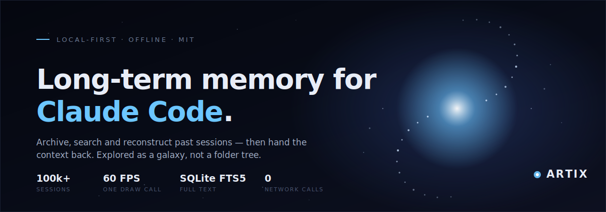

<div align="center">



<br>


**Your Claude Code sessions, archived locally and explored as a galaxy.**

[Install](#install) · [How it works](#how-it-works) · [Importing](#importing-your-claude-code-sessions) · [Architecture](docs/ARCHITECTURE.md) · [Plugins](docs/PLUGINS.md)

</div>

---

> [!IMPORTANT]
> **Everything stays on your machine.** Artix has no account system, no cloud
> sync and no telemetry. The desktop backend links no HTTP client — there is no
> code path that could send your sessions anywhere. It works with the network
> switched off, permanently.

---

## The problem

Claude Code has session limits and a finite context window. When a session ends,
the reasoning behind your decisions goes with it — and you re-explain your
project from scratch.

Artix is the archive underneath. Every past session becomes a searchable,
navigable record, so instead of re-deriving context you pick the session you
need and carry on.

## What it does

| | |
| --- | --- |
| **Archives** | Reads Claude Code's own `~/.claude/projects` store directly, plus JSONL, JSON, Markdown, text and ZIP. Deduplicated by content hash. |
| **Finds** | SQLite FTS5 over full transcripts, typo-tolerant fuzzy fallback, and a filter DSL (`tag:`, `lang:`, `project:`, `since:`). |
| **Reconstructs** | Conversation, files touched, code produced, decisions recorded, todos left open — extracted, not just stored. |
| **Hands context back** | One keystroke copies a **context bundle** sized to fit a context window. Paste it into a fresh session and keep working. |
| **Shows the shape of your work** | The archive rendered as a galaxy: recent sessions orbit the core, older work drifts outward, projects form arms. |

---

## The galaxy

Not decoration. Every visual property is derived from stored data, and nothing
moves randomly.

| Visual | Meaning |
| --- | --- |
| Distance from core | **Age** — recent work sits near the centre |
| Angle | **Project** — each owns an arm sector, so its sessions form a streak |
| Size | **Complexity** — message, file and artifact volume |
| Brightness | **Importance** — recency, size, pinned state |
| Colour | **Language** — TypeScript blue, Python green, Rust purple, Go orange… |
| Star / planet / asteroid | Large project · focused task · small or archived work |
| Rotation | A rigid density-wave pattern, so arms never shear apart |

Scrubbing the timeline moves the galaxy's "present" and the whole disk
reorganises chronologically — computed in the vertex shader, so it costs nothing.

---

## Install

```bash
git clone https://github.com/<you>/artix.git
cd artix
npm install
```

```bash
npm run dev            # browser preview, seeded with a demo galaxy
npm run dev:desktop    # the real desktop app
npm run build:desktop  # installers for your platform
```

The desktop build needs the [Rust toolchain](https://rustup.rs) and your
platform's Tauri prerequisites. Full instructions — including offline
vendoring — are in **[docs/INSTALL.md](docs/INSTALL.md)**.

> [!NOTE]
> `npm run dev` runs the whole frontend against an in-memory storage adapter, so
> you can evaluate the galaxy without installing Rust. The desktop build swaps in
> SQLite + FTS5 and real filesystem access. Both satisfy the same interface, so
> behaviour matches.

---

## Importing your Claude Code sessions

Claude Code stores transcripts as line-delimited JSON:

```
~/.claude/projects/<encoded-project-path>/<session-uuid>.jsonl
```

Press <kbd>Ctrl</kbd>+<kbd>Shift</kbd>+<kbd>I</kbd> (or **Import from Claude
Code** on first run). Artix scans that directory, shows you exactly what it
found and where, and imports only after you confirm. **It never watches the
directory in the background.**

The parser is deliberately tolerant — it looks for the handful of things any
reasonable transcript format has and ignores the rest, so a future change to
Claude Code's on-disk layout degrades gracefully instead of breaking your
archive. It understands:

- `aiTitle` — the generated session title
- `thinking` blocks — preserved as quoted reasoning, not discarded
- `gitBranch` — captured as a `branch:` tag
- `cwd` — the authoritative project path
- `isSidechain` — sub-agent transcripts, skipped and reported
- tool calls — rendered as readable, searchable JSON

Also supported: <kbd>Ctrl</kbd>+<kbd>I</kbd> for individual files, folder
scanning, and drag-and-drop onto the window.

---

## Getting context back out

Select a session and press <kbd>Ctrl</kbd>+<kbd>Shift</kbd>+<kbd>C</kbd>. Artix
builds a briefing in strict priority order and stops when the token budget is
spent:

```
1. Identity      what, where, when
2. Summary       your own notes first
3. Decisions     the why — never recoverable from the code
4. Open todos    what to do next
5. Architecture  orientation without reading the tree
6. Files touched pointers, not contents
7. Key code      only if budget remains
8. How it ended  first to be cut
```

It deliberately favours **file pointers over file contents** — telling the
assistant which files matter and to re-read them is cheaper and more accurate
than shipping a possibly-stale snapshot.

---

## Controls

| Gesture | Action |
| --- | --- |
| Wheel / trackpad | Zoom |
| Drag | Orbit |
| Middle-drag or <kbd>Shift</kbd>+drag | Pan |
| Click | Select and fly toward |
| Double-click | Open the session |
| Right-click | Context menu |
| <kbd>Ctrl</kbd>+<kbd>K</kbd> | Command palette and search |
| <kbd>/</kbd> | Focus inline search |
| <kbd>Ctrl</kbd>+<kbd>Shift</kbd>+<kbd>C</kbd> | Copy context bundle |
| <kbd>Ctrl</kbd>+<kbd>Shift</kbd>+<kbd>I</kbd> | Import from Claude Code |
| <kbd>Ctrl</kbd>+<kbd>/</kbd> | All shortcuts |

---

## How it works

```
src/
  core/        domain model, extraction, hashing, celestial classification
  storage/     StorageAdapter + SQLite (Tauri) and in-memory implementations
  search/      query DSL, FTS5 builder, fuzzy matcher, inverted index, ranking
  renderer/    galaxy: layout, shaders, camera rig, spatial index, quality tiers
  importers/   Claude Code JSONL, JSON, Markdown, text + registry and pipeline
  exporters/   Markdown, JSON, text, ZIP, context bundle
  plugins/     plugin host, typed API, built-in example plugin
  commands/    command registry and keybindings
  state/       zustand stores and the application container
  ui/          React components
src-tauri/     Rust backend: schema, migrations, queries, filesystem, IPC
```

`core/` imports nothing — not React, not Three.js, not storage. That constraint
is why the domain logic is testable in isolation and the suite runs in seconds
with no DOM.

**One draw call.** The entire library is a single `THREE.Points` whose vertex
shader computes every position from static attributes plus a few uniforms. The
CPU uploads geometry once and then does almost nothing per frame.

### Measured at 100,000 sessions

| Operation | Time |
| --- | --- |
| Layout computation (one-time) | 96 ms |
| Geometry packing → 6 MB of GPU buffers | 8.5 ms |
| Spatial index build | 25 ms |
| Hit-test (per pick) | 0.66 ms |
| Text search | 13.5 ms |
| Typo-tolerant search | 8.8 ms |

Real-world import: **14 transcripts / 11,756 messages / 65 MB parsed with zero
failures**; an 11.5 MB transcript parses in 248 ms.

---

## Extending

Artix hardcodes no providers. Importers, exporters, commands, panels and whole
visualisations are contributions to a registry — and every built-in registers
through the same API a plugin uses.

```ts
export const myPlugin: ArtixPlugin = {
  id: 'acme.notion',
  name: 'Notion importer',
  version: '1.0.0',
  activate(api) {
    api.contributeImporter({ /* … */ });
  },
};
```

There are deliberately **no network primitives in the plugin API**. Artix's
premise is that it works offline forever, and a plugin cannot change that.
See **[docs/PLUGINS.md](docs/PLUGINS.md)**.

---

## Scripts

| Command | Does |
| --- | --- |
| `npm run dev` | Vite dev server (browser preview) |
| `npm run dev:desktop` | Tauri dev with hot reload |
| `npm run build` | Typecheck + production frontend bundle |
| `npm run build:desktop` | Platform installers |
| `npm test` | Frontend unit tests (162) |
| `cd src-tauri && cargo test` | Backend storage tests (23) |
| `npm run icons` | Regenerate the app icon set |

---

## Documentation

| | |
| --- | --- |
| [Architecture](docs/ARCHITECTURE.md) | Layers, data flow, and the reasoning behind each design decision |
| [Installation](docs/INSTALL.md) | Prerequisites per platform, offline packaging, troubleshooting |
| [Database schema](docs/SCHEMA.md) | Tables, indexes, FTS5 layout, migrations |
| [Plugins](docs/PLUGINS.md) | Writing, testing and shipping a plugin |
| [Contributing](CONTRIBUTING.md) | Development workflow and conventions |
| [Security](SECURITY.md) | Threat model and reporting |

---

## Licence

[MIT](LICENSE) — do what you like with it.
